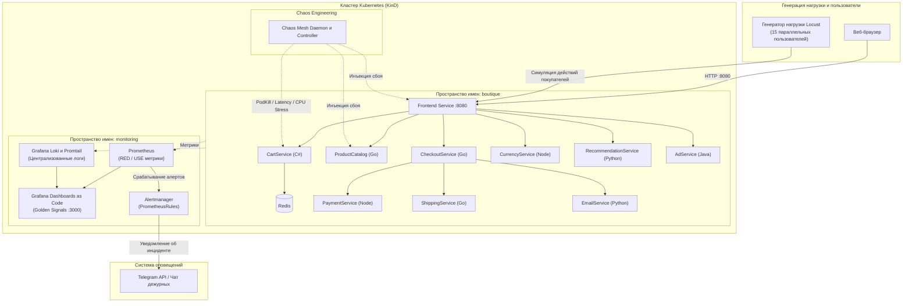

# k8s-chaos-observability

[](https://github.com/jasmingaleeva/k8s-chaos-observability/actions)
[](https://kubernetes.io)
[](https://prometheus.io)
[](https://grafana.com)
[](https://grafana.com/oss/loki/)
[](https://chaos-mesh.org)
[](https://locust.io)

Отказоустойчивая микросервисная архитектура в Kubernetes, демонстрирующая практики Chaos Engineering, полный стек наблюдаемости SRE (Golden Signals) и автоматическое восстановление под реальной нагрузкой.

---

## Описание проекта

Проект реализует микросервисную архитектуру на базе Google Online Boutique (11 распределенных сервисов на разных языках программирования), интегрированную с полноценным стеком SRE Observability и платформой тестирования надежности Chaos Mesh. Нагрузка на систему генерируется в режиме реального времени с помощью Locust.

При возникновении сбоев (принудительное завершение критических подов, инъекция сетевых задержек, насыщение ресурсов процессора) платформа автоматически фиксирует аномалии, визуализирует их на дашбордах Grafana в соответствии с 4 золотыми сигналами SRE, отправляет уведомления через Alertmanager и валидирует механизмы самовосстановления Kubernetes.



---

## Технологический стек

| Область | Технология | Назначение |
|---|---|---|
| **Оркестрация** | Kubernetes v1.32 (KinD) | Управление жизненным циклом распределенных контейнеров |
| **Приложение** | Google Online Boutique | 11 микросервисов (Go, C#, Python, Node.js, Java) |
| **Метрики и правила** | Prometheus и Prometheus Operator | Сбор метрик RED/USE, декларативные CRD `PrometheusRule` |
| **Агрегация логов** | Grafana Loki и Promtail | Централизованный сбор и запросы логов на LogQL |
| **Визуализация** | Grafana (Dashboard as Code) | Мониторинг 4 золотых сигналов SRE в реальном времени |
| **Chaos Engineering** | Chaos Mesh v2.8 (CNCF) | Инъекция сбоев: PodKill, Network Delay, CPU Stress |
| **Нагрузочное тестирование** | Locust (Python) | Симуляция сценариев поведения покупателей в интернет-магазине |
| **Оповещения** | Alertmanager и Telegram API | Отправка форматированных алертов при деградации SLO |
| **Автоматизация и CI** | Makefile, GitHub Actions | Развертывание в одну команду, линтинг и smoke-тесты |

---

## Быстрый старт

### Требования к окружению
* Docker Desktop (с бэкендом WSL 2 на Windows или нативная служба Docker на Linux)
* `kubectl`, `helm`, `kind`, `git`, `make`

### 1. Клонирование репозитория и запуск
```bash
git clone https://github.com/jasmingaleeva/k8s-chaos-observability.git
cd k8s-chaos-observability

# Развертывание кластера, приложения, мониторинга и Chaos Mesh в одну команду
make all
```

### 2. Доступ к веб-интерфейсам
Порты проброшены напрямую на хост-систему (дополнительный port-forward не требуется):
* **Приложение Online Boutique**: [http://localhost:8080](http://localhost:8080)
* **Дашборд Grafana SRE**: [http://localhost:3000](http://localhost:3000) *(Логин: `admin`, Пароль: `admin`)*
* **Панель управления Chaos Mesh**: [http://localhost:2333](http://localhost:2333)

---

## Мониторинг: SRE Golden Signals

Дашборд Grafana (**Microservices SRE Golden Signals & Logs**) разворачивается декларативно как код (`monitoring/dashboards/sre-golden-signals-cm.yaml`) и включает в себя:

1. **Traffic (Трафик)**: входящая и исходящая сетевая активность по каждому микросервису (КБ/с).
2. **Errors (Ошибки)**: частота перезапусков подов при сбоях и количество подов в нерабочем состоянии.
3. **Saturation (Насыщение)**: использование вычислительных ресурсов (ядра CPU) и оперативной памяти (МБ) относительно лимитов.
4. **Централизованные логи**: живой поток логов из Grafana Loki с фильтрацией по пространству имен `boutique`.

---

## Сценарии Chaos Engineering

Запуск подготовленных экспериментов выполняется через `make`:

### Сценарий 1: Отстрел подов (Pod Kill)
Принудительное завершение пода сервиса корзины `cartservice` для проверки самовосстановления ReplicaSet и реакции алертинга:
```bash
make chaos-pod-kill
```
* **Ожидаемый результат**: Под мгновенно завершается сигналом SIGKILL. Контроллер ReplicaSet создает замену за 4 секунды. Срабатывает алерт `CartServicePodDown`.

### Сценарий 2: Сетевые задержки (Network Latency)
Инъекция сетевой задержки 500 мс на обращения к сервису каталога товаров `productcatalogservice`:
```bash
make chaos-network-delay
```
* **Ожидаемый результат**: Возрастает 95-й перцентиль времени ответа (P95 latency) на страницах каталога и оформления заказа.

### Сценарий 3: Стресс-нагрузка CPU (Resource Exhaustion)
Создание искусственной нагрузки на процессор (85% на 2 воркерах) для сервиса `frontend`:
```bash
make chaos-stress-cpu
```
* **Ожидаемый результат**: На панели Saturation фиксируется всплеск утилизации CPU, алерт `FrontendCPUSaturation` переходит в статус FIRING.

### Очистка активных экспериментов
```bash
make chaos-clean
```

---

## Нагрузочное тестирование Locust

Генерация реалистичного трафика пользователей внутри кластера:
```bash
make load-test
```
Сценарий охватывает типичный пользовательский путь:
* Просмотр главной страницы (`GET /`)
* Переход на карточки товаров (`GET /product/[id]`)
* Добавление товаров в корзину (`POST /cart`)
* Просмотр содержимого корзины (`GET /cart`)
* Завершение покупки (`POST /cart/checkout`)

Просмотр текущих метрик нагрузки:
```bash
kubectl logs -n boutique -l job-name=locust-load-test -f
```

---

## Настройка оповещений в Telegram

Правила мониторинга описаны в виде CRD `PrometheusRule` в файле `monitoring/alerts/golden-signals-rules.yaml`:
* `CartServicePodDown`: срабатывает при отсутствии работающих подов сервиса корзины более 15 секунд (`severity: critical`).
* `MicroserviceRestartSpike`: фиксирует перезапуски контейнеров за последние 3 минуты (`severity: warning`).
* `FrontendCPUSaturation`: фиксирует превышение потребления CPU фронтендом более 300m в течение 30 секунд (`severity: warning`).
* `ServiceDegradedUnreadyPods`: фиксирует наличие нерабочих подов в пространстве имен `boutique` (`severity: critical`).

### Подключение Telegram-бота:
1. Создайте бота через [@BotFather](https://t.me/BotFather) и сохраните `BOT_TOKEN`.
2. Узнайте свой `CHAT_ID` с помощью [@userinfobot](https://t.me/userinfobot).
3. Укажите значения в `monitoring/values/prometheus-values.yaml`:
   ```yaml
   telegram_configs:
     - bot_token: "<YOUR_TELEGRAM_BOT_TOKEN>"
       chat_id: <YOUR_CHAT_ID>
       send_resolved: true
   ```
4. Примените обновленную конфигурацию:
   ```bash
   make deploy-monitoring
   ```

---

## Отчет об инциденте (SRE Post-Mortem)

Пример профессионального анализа инцидента, произошедшего во время инъекции хаоса, представлен в документе:
[docs/post-mortem-incident-01.md](docs/post-mortem-incident-01.md)

---

## Структура репозитория

```text
k8s-chaos-observability/
├── .github/
│   └── workflows/
│       └── ci.yaml                    # CI-пайплайн: линтинг, валидация синтаксиса и KinD smoke-тест
├── apps/
│   └── boutique/
│       ├── namespace.yaml             # Пространство имен boutique
│       └── release.yaml               # Манифесты 11 микросервисов
├── chaos/
│   ├── values.yaml                    # Helm values для Chaos Mesh (NodePort 32333)
│   ├── pod-kill.yaml                  # PodChaos: отстрел пода cartservice
│   ├── network-delay.yaml             # NetworkChaos: задержка 500мс к каталогу
│   └── stress-cpu.yaml                # StressChaos: 85% CPU на frontend
├── monitoring/
│   ├── values/
│   │   ├── prometheus-values.yaml     # Prometheus, Grafana и Alertmanager Telegram config
│   │   └── loki-values.yaml           # Настройки сбора логов Loki и Promtail
│   ├── dashboards/
│   │   ├── grafana-datasources-cm.yaml# Datasource as Code (Prometheus, Loki, Alertmanager)
│   │   └── sre-golden-signals-cm.yaml # SRE Golden Signals Dashboard as Code
│   └── alerts/
│       └── golden-signals-rules.yaml  # CRD PrometheusRule (SRE-правила алертинга)
├── load-testing/
│   ├── locustfile.py                  # Сценарий нагрузки пользователей на Python
│   └── k8s-locust-job.yaml            # Headless запуск Locust внутри кластера
├── cluster/
│   └── kind-config.yaml               # Конфигурация KinD с пробросом портов (8080, 3000, 2333)
├── docs/
│   └── post-mortem-incident-01.md     # Производственный отчет об инциденте (Post-Mortem)
├── Makefile                           # Единый интерфейс команд автоматизации
└── README.md                          # Главная документация проекта
```

---

## Удаление стенда

Для удаления локального кластера и высвобождения системных ресурсов выполните:
```bash
make clean
```
